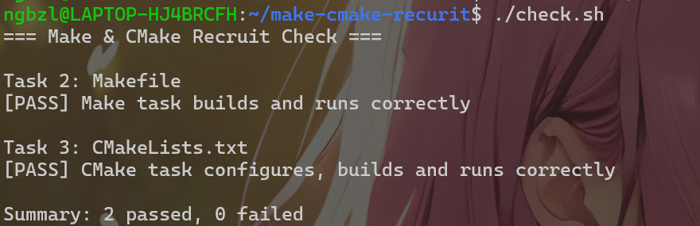

# Task 4：思考题

## 1. Make 和简单的 build.sh 有什么区别？

Make做的是增量构建，只重新编译变化的文件和以变化的文件为依赖的文件，节省编译时间和减少编译负担

## 2. CMake 是编译器吗？

执行 `cmake --build build` 时，最终是谁在编译 C 源文件？

不是。是Makefile文件的生成器。是gcc在编译。

## 3. 为什么不希望每次都重新编译所有 `.c` 文件？

消耗时间，且项目较大结构复杂时时间成本极高，避免电脑无意义重复劳动。只需编译更改的文件及以其为依赖的文件。
